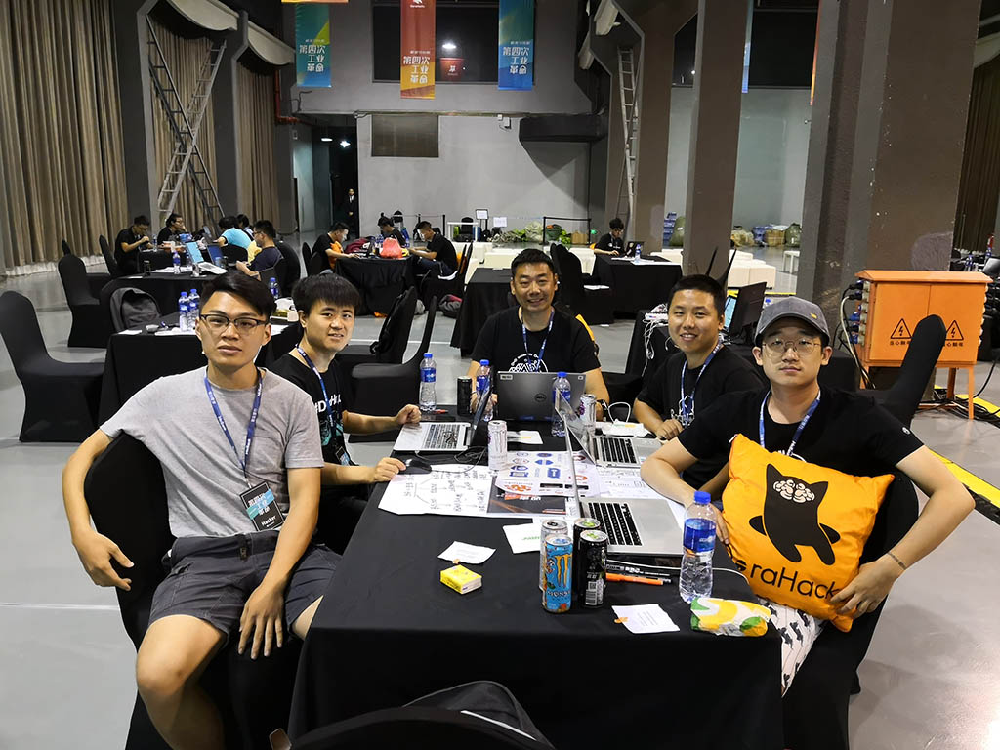

# RUNARUN-更好用的赛事票务dApp

作为一位马拉松严肃跑者，在近十年中见证了这项运动快速成长。随着赛事的火爆，参赛资格逐渐成为了稀缺资产，千金难求一票的现象屡见不鲜。同时，票务销售公平性缺失、实名制和资质审查成本过高、已购票难以方便转手等问题一直困扰着主办方和运动爱好者们。

这次黑客马拉松，我们希望通过36个小时的全力以赴来解决这个问题。我们以一次标准的马拉松赛事作为应用场景，通过开发一个基于区块链的实名电子票务发行和流转平台，包含报名、支付、转让、存证等功能。通过发行ERC721资产的方式来管理票务。通过DID注册，管理实名制报名信息和个人Profile。个人的历史完赛记录作为存证经第三方证明签名上链。报名和转让票务时通过智能合约来对比链上证据，公开透明的进行资质审核。

将这些原来本应由主办方完成但由于成本太高而不可能完成的工作，我们通过区块链和智能合约高效而低成本的做好。让马拉松运动的参与者和主办方能够更多的享受运动的乐趣，少一些票务的烦恼。同时，我们的业务模型可以广泛适用于大多数票务场景，用更低的成本让大众享受更便捷的服务，成长潜力巨大。

## 参考链接

[抓到一次就终身禁赛，马拉松名额竟还有人公开买卖！各地马拉松为何这么火？](http://news.sina.com.cn/o/2017-09-18/doc-ifykyfwq8158610.shtml)

[马拉松不文明行为PK台：你最反感哪种行为？](https://sports.sina.cn/running/2019-07-15/detail-ihytcerm3712012.d.html?pos=10&vt=4)

[以后再转让马拉松名额将被终身禁赛!](http://www.sohu.com/a/121887520_114613)

## 视频介绍
[YOUTUBE](https://youtu.be/3VqscdUhTYI)

## 团队成员

- 队长：辛卫民（星哥）
  - 星点科技CEO，ElastosDMA项目创始人，聚焦基于区块链和通证经济的去中心化商业平台
- 产品：王武 
  - 归焉CEO，专注于让世界更美好和区块链应用研发。
- 设计：张源
  - 新晋设计师，毕业于清华大学美术学院，ChinaVis 获奖者
- Java：郑鹏
  - 金融科技领域资深Java开发工程师
- 安卓：Jensen
  - 曾就职于网易杭州研究院，网易云音乐，现JellyDrops初创合伙人，致力于将AI赋能于美妆行业

## 团队口号
**用区块链应用点亮大众生活**  

**Let's build commercial ready dApps together!**

## 主要解决问题
- 主办方资质审核成本高
- 实名制票难转手
- 合规转让票务成本过高，违规转让票务风险巨大
- 稀缺性票务的购票公平性缺失

## 主要功能
- 票务上链发行
- 用户DID实名认证
- 完赛记录上链存证，含第三方证明签名
- 合规、合格、在线便捷报名购票
- 实名转让，实名身份再绑定
- 所有操作通过智能合约完成，透明公开

## 其它亮点
- Hacker方式闪电组队：线上认识，临时组队，快速分工，全力投入
- 零行代码启动，36小时挑战极限
- 资深用户、实际痛点、真实应用场景
- 快速实现（基于ElastosDMA SDK）
- 可商业落地
